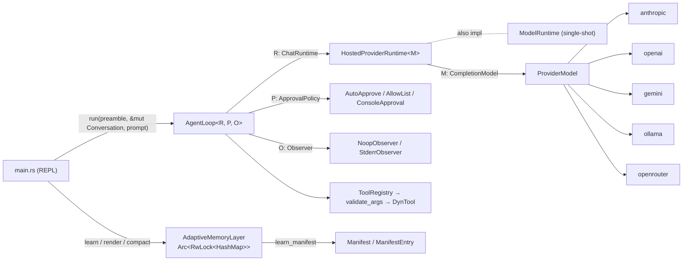
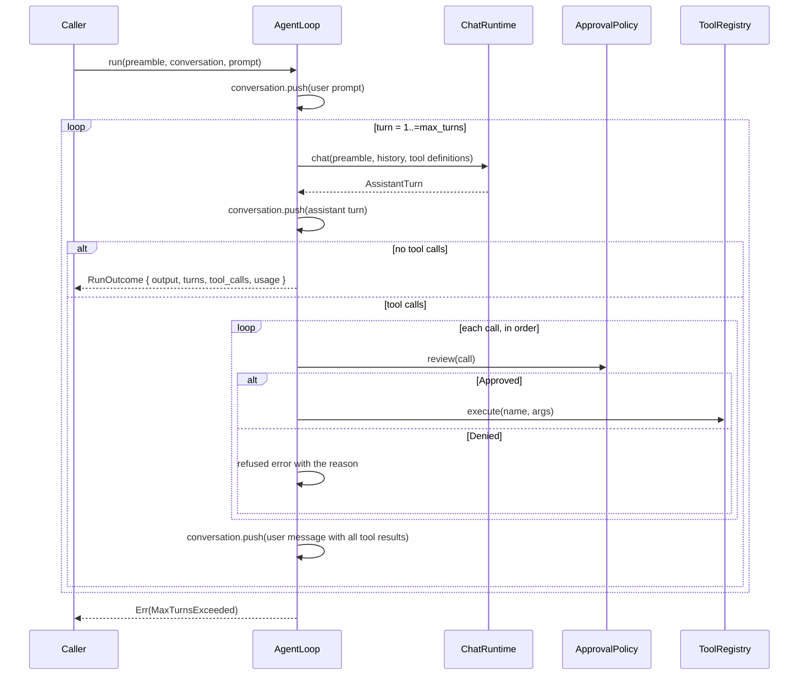
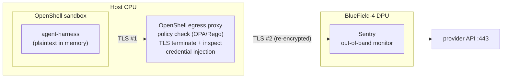

# agent-harness

A modular, type-safe, model-agnostic agent harness in Rust, built on [`rig-core`](https://crates.io/crates/rig-core) 0.42.

Execution code talks to two small traits, `ModelRuntime` (one prompt, text out) and `ChatRuntime` (a conversation plus tools, one structured turn out), and never to a provider directly. Swapping between Anthropic, OpenAI, Gemini, Ollama and OpenRouter (or a mock in tests) is a change of type parameter or a runtime `/model` command, not a change of calling code. `AgentLoop` drives multi-turn, tool-calling runs with a human-in-the-loop approval gate. Learned environment facts live in a shared, schema-less `AdaptiveMemoryLayer` that can be compacted for small local models. The crate ships a library (`agent_harness`) and an interactive CLI (`agent-harness`).

- [Architecture](#architecture)
  - [Design principles](#design-principles)
  - [Module map](#module-map)
  - [Runtimes](#runtimes)
  - [The agent loop](#the-agent-loop)
  - [AdaptiveMemoryLayer](#adaptivememorylayer)
  - [Data schemas](#data-schemas)
  - [Provider layer](#provider-layer)
  - [Tool pipeline](#tool-pipeline)
- [Security model](#security-model)
- [User guide](#user-guide)
  - [Requirements](#requirements)
  - [Build and test](#build-and-test)
  - [Using the CLI](#using-the-cli)
  - [Bounded launch](#bounded-launch)
  - [Using the library](#using-the-library)
  - [Writing a runtime](#writing-a-runtime)
  - [Writing a tool](#writing-a-tool)
  - [Adding a provider](#adding-a-provider)
- [Testing](#testing)
- [Limitations](#limitations)

---

## Architecture

### Design principles

| Principle | How it shows up |
|---|---|
| **Trait-driven separation** | Model access is `ModelRuntime` / `ChatRuntime`; tools, approval and observation are each their own trait. |
| **Static dispatch by default** | `AgentLoop<R, P, O>` is generic over runtime, policy and observer; `HostedProviderRuntime<M>` over the rig model. Runtime provider switching uses a closed `enum` (`ProviderModel`), not `dyn`. The only type erasure is the tool registry. |
| **`Send` futures** | Both runtime traits return `impl Future + Send`, so any runtime can be driven from `tokio::spawn`. Implementors still write plain `async fn`. |
| **Deterministic execution** | Tool calls run sequentially in the order requested; memory renders sorted by key; compaction never depends on `HashMap` order. |
| **Human-in-the-loop** | Every tool call passes an `ApprovalPolicy` before it runs. The CLI asks the operator by default. |
| **Failures are feedback** | Unknown tools, bad arguments, tool errors and denials go back to the model as tool results. Only runtime-level failures abort a run, and then the conversation is rolled back. |
| **No secrets in code** | Credentials are read only from environment variables, via rig's `ProviderClient::from_env`. |
| **Thread safety** | Runtimes, `AgentLoop`, `Conversation`, `AdaptiveMemoryLayer`, `ProviderModel`, schemas and built-in policies are `Send + Sync + 'static`, and tests assert it. |
| **Defense in depth** | The process is designed to run inside an NVIDIA OpenShell sandbox with an independent BlueField-4 Sentry monitor on the egress path. See [Security model](#security-model). |

### Module map

```
src/
├── main.rs              CLI: REPL over AgentLoop, console approval, model switching, memory commands
├── lib.rs               Public API and re-exports (including `rig_core`)
├── models.rs            AgentTask, ManifestEntry, Manifest: provider-agnostic schemas
├── harness/
│   ├── mod.rs           Harness exports
│   ├── runtime.rs       ModelRuntime, ChatRuntime, AssistantTurn, HostedProviderRuntime<M>
│   ├── agent.rs         AgentLoop<R, P, O>, RunOutcome: the tool-calling loop
│   ├── conversation.rs  Conversation: multi-turn message history
│   └── memory.rs        AdaptiveMemoryLayer, CompactionPolicy, CompactionReport
├── provider.rs          Provider, ModelSpec, ProviderModel: runtime provider/model selection
├── tool.rs              DynTool (object-safe tool) and ToolRegistry
├── validate.rs          Deterministic JSON-Schema-subset argument validation
├── policy.rs            ApprovalPolicy, Approval, AutoApprove, AllowList
├── observer.rs          Observer lifecycle hooks, NoopObserver
├── error.rs             HarnessError
└── tools/               Example tools: Calculator, WordCount
docs/
└── security-architecture.md   Policy review, egress data path, Sentry mapping
openshell-policy.yaml    OpenShell sandbox policy (v0.0.116 schema)
run-bounded.sh           Checks the policy, mocks its layout locally, then launches the REPL
validate-openshell.sh    Runs the harness in a live OpenShell sandbox and checks each policy rule
sandbox.Dockerfile       Sandbox image used by validate-openshell.sh
providers/openai.yaml    OpenShell provider profile: OpenAI key injection, pinned to the harness
```



### Runtimes

```rust
pub trait ModelRuntime: Send + Sync {
    fn prompt_agent(&self, preamble: &str, payload: &str)
        -> impl Future<Output = Result<String, anyhow::Error>> + Send;
}

pub trait ChatRuntime: Send + Sync {
    fn chat(&self, preamble: &str, history: &[Message], tools: &[ToolDefinition])
        -> impl Future<Output = Result<AssistantTurn, anyhow::Error>> + Send;
}
```

- **`ModelRuntime`** is the single-shot contract: system instructions plus one request in, the model's text out.
- **`ChatRuntime`** is the multi-turn, tool-aware contract. It receives the whole history (rig's provider-neutral `Message`, so a history built on one model replays on another) and the tool definitions to advertise, and returns one **`AssistantTurn`**: `content` (text, tool calls and reasoning, in order), `message_id` and `usage`. Helpers: `text()`, `tool_calls()`, `into_message()` (keeps every part unchanged so provider ids and signatures round-trip), and `text_reply()` for scripted runtimes.

**`HostedProviderRuntime<M: CompletionModel>`** implements both for any rig model:

| Method | Effect |
|---|---|
| `new(model)` | Wrap a model. `max_tokens` defaults to `DEFAULT_MAX_TOKENS` (4096), always sent so Anthropic never needs a model-specific default. |
| `with_max_tokens(n)`, `with_temperature(t)` | Builder-style request settings. |
| `model()`, `set_model(new)` | Inspect or replace the model; `set_model` returns the old one. |

`chat` builds a `CompletionRequest` with a leading `Message::system(preamble)` (omitted when empty), the history and the tool definitions, runs `validate_message_content()`, and wraps provider failures with `"completion request failed"` context. `prompt_agent` is `chat` with a one-message history and no tools; a reply with no text is an error.

#### When to use single-shot

`AgentLoop` is for open-ended work where the model chooses the steps. `ModelRuntime` is for steps where your code fixes the flow and the model fills in one step. The bundled CLI no longer calls it, so it is a library entry point for that kind of pipeline:

- **No tools by type.** Code generic over `R: ModelRuntime` cannot reach a tool, and the compiler enforces it. Use it on untrusted input (logs, tickets, web content): a prompt injection in the input has nothing to trigger.
- **Stateless steps:** classify, summarize, extract, rerank, check an answer. Each call stands alone, so there is no history to grow or trim.
- **Parallel fan-out.** No shared `&mut Conversation`, so independent calls run concurrently (e.g. `join_all` over many inputs).
- **One-method backends and mocks.** A test double or a completion-only engine implements one method instead of `ChatRuntime`.

Example: a root-cause analyzer over system health signals uses single-shot calls for most steps and the loop only where tools are needed:

```
signals ──► [ModelRuntime] summarize each window   (parallel, untrusted input, no tools)
        ──► [ModelRuntime] classify anomaly / severity
        ──► [AgentLoop]    investigate: query metrics, correlate, propose a cause
        ──► [ModelRuntime] check the proposed cause against the evidence
```

Answers are plain `String` today. Typed answers (via `CompletionRequest.output_schema`) would make it a better fit for pipelines; see [Limitations](#limitations).

### The agent loop

`AgentLoop<R: ChatRuntime, P: ApprovalPolicy = AutoApprove, O: Observer = NoopObserver>` owns the runtime, a `ToolRegistry`, the policy, the observer and `max_turns` (default `DEFAULT_MAX_TURNS` = 8). It does **not** own conversation state: a `Conversation` is passed to `run` by `&mut`, so one loop can serve many conversations and a conversation survives a model switch (`runtime_mut().set_model(...)`).

```rust
let agent = AgentLoop::new(runtime, tools)        // AutoApprove, NoopObserver
    .with_policy(AllowList::new(["calculator"]))
    .with_observer(my_observer)
    .with_max_turns(6);
let outcome = agent.run(preamble, &mut conversation, "What is 17 * 23?").await?;
```

`run(preamble, &mut conversation, prompt)`:



- **Tool results** carry the original call's `id` and `provider` identifiers, so every provider can match result to call. All results from one turn go into one user message.
- **Errors.** `HarnessError::Runtime` (the model call failed), `EmptyResponse` (no content) and `MaxTurnsExceeded(n)` abort the run. On any error the conversation is **rolled back** to its state before the call, so a failed run never leaves a half-finished turn in the history. Tool problems are never errors; they become tool results.
- **Observer hooks:** `on_turn_start`, `on_model_response` (with the `AssistantTurn`), `on_tool_call` (with the approval decision), `on_tool_result`, `on_final_answer`.

`Conversation` is a plain ordered `Vec<Message>` with `messages`, `push`, `len`, `clear` and `truncate`. It is unbounded. If you trim it, never separate an assistant tool-call message from the user message holding its results; providers reject orphaned calls or results.

### AdaptiveMemoryLayer

A cheaply cloneable handle over `Arc<RwLock<HashMap<String, String>>>`. Clones share one map, so every execution domain sees what any other has learned. Locks are `std::sync::RwLock`, held for one map operation and never across an `.await`. A poisoned lock is recovered rather than propagated: every mutation is a single map call on plain strings, so a panicking writer cannot leave the map inconsistent.

| Method | Effect |
|---|---|
| `learn(key, value)` | Insert; returns the replaced value. |
| `learn_manifest(&entries)` | Insert every `ManifestEntry` (non-string JSON values stored as compact JSON). |
| `recall`, `forget`, `clear`, `len`, `is_empty`, `total_bytes` | The usual accessors; sizes count key + value bytes. |
| `render()` | `key: value` lines sorted by key, for inclusion in a prompt. |
| `compact(policy)` | Strip context-window bloat in place; returns a `CompactionReport`. |

`compact` runs four deterministic steps:

1. collapse whitespace runs and trim each value;
2. drop entries left empty;
3. truncate values to `max_value_chars` (on a character boundary, trailing space trimmed);
4. evict the largest entries (ties broken by key) until the store fits `max_total_bytes`.

`CompactionPolicy::SMALL_MODEL` is 256 characters per value and 2048 bytes total. The CLI applies it automatically before each prompt when the active provider is Ollama. `CompactionReport` records `dropped_empty`, `rewritten`, `evicted`, `bytes_before` and `bytes_after`.

Memory is **process-local and not persisted**. It is lost when the process exits.

### Data schemas

`src/models.rs`, all `Serialize + Deserialize`:

| Type | Shape |
|---|---|
| `AgentTask` | `{ preamble, payload }`; `preamble` defaults to `""` when absent. |
| `ManifestEntry` | `{ key, value }` where `value` is any JSON. `value_text()` gives strings unquoted and everything else as compact JSON. |
| `Manifest` | `{ entries: [ManifestEntry] }`. `get(key)` returns the **last** matching entry, so later entries override earlier ones. |

### Provider layer

`src/provider.rs` makes the model choosable at runtime without trait objects:

- **`Provider`** is an enum of supported backends, with `name()`, `api_key_env()` and `default_model()`.
- **`ModelSpec`** is `provider[:model]`, parsed with `FromStr`. Only the first `:` separates the two, so `ollama:llama3.2:3b` keeps the model id `llama3.2:3b`. A spec with no model uses the provider's default; providers without a default reject it.
- **`ProviderModel`** holds a `ModelSpec` and a private `Backend` enum of each rig provider's concrete model type. Its `CompletionModel` impl forwards through a `match`: no boxing, no vtables.

| Provider | Spec name | Default model | Credentials / config (read by rig) |
|---|---|---|---|
| Anthropic | `anthropic` | `claude-sonnet-5` | `ANTHROPIC_API_KEY`, optional `ANTHROPIC_BASE_URL` |
| OpenAI | `openai` | `gpt-5.6` | `OPENAI_API_KEY`, optional `OPENAI_BASE_URL` |
| Google Gemini | `gemini` | `gemini-2.5-flash` | `GEMINI_API_KEY` |
| Ollama | `ollama` | *(model required)* | optional `OLLAMA_API_BASE_URL` (default `http://localhost:11434`), optional `OLLAMA_API_KEY` |
| OpenRouter | `openrouter` | *(model required)* | `OPENROUTER_API_KEY` |

`ProviderError` covers `UnknownProvider`, `ModelRequired` and `Client { provider, source }` (for example a missing API key).

### Tool pipeline

```
model's ToolCall { name, arguments: serde_json::Value }
        │
        ▼
ApprovalPolicy::review ──Denied──► ToolExecutionError::refused("tool call denied: …")
        │ Approved
        ▼
ToolRegistry::execute
  ├─ lookup by name ─────────────► not_found("unknown tool `x`")
  ├─ validate_args(schema, args) ► invalid_args("missing required argument `a`")
  ├─ serde_json::from_value::<Args> ► invalid_args(serde message)
  └─ PortableTool::call(args) ──► ToolOutput, or map_error(e)
        │
        ▼
ToolResult content sent back to the model
```

| Component | Purpose |
|---|---|
| `ToolRegistry` | `register` (duplicate names → `HarnessError::DuplicateTool`), `definitions` (sent every turn, in registration order), and `execute(name, args)`. |
| `DynTool` | Object-safe wrapper; every rig `PortableTool` gets it via a blanket impl. One `Box` per tool, one boxed future per call. |
| `validate_args` | Deterministic subset of JSON Schema: `type: object`, `required`, and primitive property types. Serde is the final gate. |
| `ApprovalPolicy` | Async gate: `AutoApprove`, `AllowList`; the CLI's `ConsoleApproval` asks the operator. |
| `tools::Calculator`, `tools::WordCount` | Example tools, registered in the CLI. |

`ToolExecutionError::model_output()` decides what the model sees. rig's default `map_error` sends only safe, kind-level feedback; override it (as `Calculator` does) when the error text is safe and useful to show the model.

---

## Security model

Defense in depth across three independent layers. Full detail, findings and sources are in [`docs/security-architecture.md`](docs/security-architecture.md).



| Layer | Enforcer | Sees plaintext? | Role |
|---|---|---|---|
| 1. In process | the code (`ModelRuntime` boundary, env-only credentials) | yes | The cheapest place for audit logging and redaction, e.g. a `ModelRuntime` decorator. |
| 2. Sandbox runtime | NVIDIA OpenShell: filesystem (Landlock), process (seccomp), network policy evaluated at its egress proxy | yes, for inspected HTTPS (the proxy terminates TLS) | Primary policy enforcement and content inspection. Attached providers replace keys with placeholders the proxy resolves in header values, so real keys never enter the sandbox. This covers rig's `x-api-key` and `Authorization: Bearer` with no code change. |
| 3. Hardware, out of band | NVIDIA Sentry on BlueField-4 | not from the re-encrypted stream on its own (*unverified* what Sentry can inspect) | Independent check on the egress path that keeps working if the host or proxy is compromised. |

Key properties:

- **Encryption happens in-process.** rig/reqwest encrypts before traffic leaves the harness. There is no unencrypted token stream on the wire to port 443.
- **Ordering.** Outbound traffic reaches the DPU *after* OpenShell's policy has allowed it. Sentry is a second enforcement point, not a pre-filter.
- **Local Ollama** is plain HTTP on port 11434, reached from the sandbox at `host.openshell.internal` on the same machine, so it should not cross the NIC or DPU.

Current status:

- `openshell-policy.yaml` follows the OpenShell v0.0.116 schema. It allows only `POST /v1/messages` (Anthropic), `POST /v1/responses` (OpenAI), `POST /v1beta/models/*:generateContent` (Gemini) and `POST /api/chat` (Ollama via `host.openshell.internal`), runs as the non-root `sandbox` user with `landlock: hard_requirement`, and makes the binary read-only. OpenShell 0.1.2 loads it unchanged and enforces it; see *Live validation* in the security doc.
- Gemini is allowlisted (`POST /v1beta/models/*:generateContent`) so a `GEMINI_API_KEY` can be used for testing. OpenShell has no built-in Gemini provider type, so keeping the key out of the sandbox needs a custom provider; see the security doc. OpenRouter is deliberately not allowlisted.
- OpenShell enforcement was validated on 2026-09-30 with `validate-openshell.sh` (process, filesystem, binary pinning, host allowlist, Gemini egress). OpenAI credential injection through `providers/openai.yaml` is validated, including a live call. L7 method/path rules and the Anthropic and Ollama paths are not yet exercised. Sentry has not been tested. `run-bounded.sh` remains an offline mock.

---

## User guide

### Requirements

- Rust toolchain **1.90+** (edition 2024; `rust-version = "1.90"` in `Cargo.toml`)
- An API key for at least one hosted provider, or a running [Ollama](https://ollama.com) server

### Build and test

```sh
cargo build --release
cargo test
cargo clippy --all-targets
```

### Using the CLI

```text
agent-harness [-m|--model <provider[:model]>] [prompt…]
```

With a prompt it runs once and exits. Without one it starts an interactive REPL. Each prompt runs through `AgentLoop` with the `calculator` and `word_count` tools and **continues the current conversation**; the preamble is the base prompt plus everything in memory. Before each tool call you are asked to approve it (`y`); anything else denies it and the model is told `tool call denied: operator rejected the call`.

**Choosing the model** (first match wins):

1. `-m` / `--model <spec>` (also `--model=<spec>`)
2. `HARNESS_MODEL` environment variable
3. `anthropic` (that is, `anthropic:claude-sonnet-5`)

**Environment variables:**

| Variable | Purpose |
|---|---|
| `ANTHROPIC_API_KEY`, `OPENAI_API_KEY`, `GEMINI_API_KEY`, `OPENROUTER_API_KEY` | Provider credentials; only the selected provider's key is needed |
| `OLLAMA_API_BASE_URL` | Ollama server URL (optional) |
| `HARNESS_MODEL` | Default model spec |
| `HARNESS_AUTO_APPROVE=1` | Skip the per-tool-call approval prompt (trusted tools only) |

Keep keys in your shell environment or a git-ignored `.env` that you `source`. Never commit them.

**Examples:**

```sh
export ANTHROPIC_API_KEY=...            # set in your shell, never in code

cargo run -- "What is 1234 * 5678?"
cargo run -- -m openai:gpt-5.5 "Count the words in 'the quick brown fox'"
cargo run -- --model=ollama:llama3.2:3b "hello"

# Non-interactive tool approval (trusted tools only)
HARNESS_AUTO_APPROVE=1 cargo run -- -m gemini "What is 2^10 via repeated multiplication?"
```

**REPL commands:**

| Command | Effect |
|---|---|
| `/model` | Show the active model |
| `/model <spec>` | Switch provider/model and keep the conversation. On error the current model stays. |
| `/providers` | List providers, default models, and whether each API key is set |
| `/learn <key> <value>` | Store a heuristic; it is added to every later preamble |
| `/forget <key>` | Remove a heuristic |
| `/memory` | Print memory, sorted by key |
| `/compact` | Compact memory with `CompactionPolicy::SMALL_MODEL` and print the report |
| `/clear` | Clear memory |
| `/reset` | Start a new conversation (memory is kept) |
| `/quit`, `/exit`, Ctrl-D | Exit |

Example session (diagnostics go to stderr):

```text
model: anthropic:claude-sonnet-5 (/model <provider[:model]> to switch)

> what is 12.5 * 8?
[turn 1]
  model requested 1 tool call(s)

[approve] calculator({"a":12.5,"b":8,"op":"mul"}) ? [y/N] y
  -> calculator Approved
  <- calculator: {"result":100.0}
[turn 2]
12.5 × 8 = 100
[anthropic:claude-sonnet-5 | 2 turn(s), 1 tool call(s), 812 tokens]

> and divided by 4?
...
```

Tool calling needs a model that returns **structured** tool calls. Some local models emit the call as plain JSON text instead, even when Ollama lists `tools` among their capabilities (observed with `qwen2.5-coder:32b`); the loop then treats that text as the final answer.

### Bounded launch

```sh
./run-bounded.sh [--dry-run] [agent-harness args…]
```

A local **mock** of the layout in `openshell-policy.yaml`. It enforces nothing (no Landlock, seccomp or egress proxy); real enforcement comes from OpenShell. It maps the policy's sandbox paths to local stand-ins:

| Policy path | Local stand-in |
|---|---|
| `/app/agent-harness` | `target/release/agent-harness` |
| `/tmp` (read-write) | `.sandbox/tmp`, mode 700, exported as `TMPDIR` |

Steps:

1. **Structure check (grep):** `version: 1`; `filesystem_policy`, `landlock`, `process` and `network_policies` present; `/app/agent-harness` listed as read-only and as an allowed binary.
2. **Schema check (Ruby's bundled YAML parser, skipped if Ruby is absent):** no unknown top-level keys; absolute paths without `..`; valid `landlock.compatibility`; no root in `process`; every network entry has endpoints and binaries; integer ports; `rest` endpoints have exactly one of `access` / `rules`; `rules` non-empty with `allow.method` and `allow.path`; valid `access` values.
3. **Non-root:** refuses to run as root, mirroring `process.run_as_user`.
4. **Mock `/tmp`:** creates `.sandbox/tmp`, refusing symlinks and paths that resolve outside the project root.
5. **Credentials:** reports whether `ANTHROPIC_API_KEY`, `OPENAI_API_KEY` and `GEMINI_API_KEY` are set, never their values. For Ollama it notes that inside the sandbox `OLLAMA_API_BASE_URL` should be `http://host.openshell.internal:11434`.
6. **Launch:** builds the release binary and `exec`s it with the remaining arguments.

`--dry-run` runs every check but creates and launches nothing. `.sandbox/` is git-ignored.

### OpenShell validation

```sh
./validate-openshell.sh [--skip-build]
```

Needs a running OpenShell gateway with the `docker` compute driver. It builds a Linux binary in `rust:1.90`, builds `sandbox.Dockerfile`, checks that the gateway reports this policy as effective, then runs probes in one sandbox: the non-root user, seccomp, writes outside `/tmp`, reads outside the allowlist, `curl` (an unpinned binary) to listed and unlisted hosts, and the harness reaching Gemini with a dummy key. A last step attaches a temporary dummy-key provider built from `providers/openai.yaml` and checks that the sandbox sees only a placeholder while OpenAI receives the substituted value. Set `OPENSHELL_LIVE_OPENAI_PROVIDER=<provider>` to add one real call. Exits non-zero on any mismatch. On colima the gateway also needs a relay into the VM; the script detects this and prints the command. See the security doc for setup notes.

### Using the library

```toml
[dependencies]
agent-harness = { path = "../agent-harness" }
tokio = { version = "1", features = ["macros", "rt-multi-thread"] }
```

A tool-calling, multi-turn run:

```rust
use agent_harness::{
    AdaptiveMemoryLayer, AgentLoop, AllowList, CompactionPolicy, Conversation,
    HostedProviderRuntime, ManifestEntry, ProviderModel, ToolRegistry,
    tools::{Calculator, WordCount},
};

#[tokio::main]
async fn main() -> anyhow::Result<()> {
    let model = ProviderModel::from_env("anthropic:claude-sonnet-5".parse()?)?;
    let mut tools = ToolRegistry::new();
    tools.register(Calculator)?;
    tools.register(WordCount)?;

    let mut agent = AgentLoop::new(HostedProviderRuntime::new(model), tools)
        .with_policy(AllowList::new(["calculator"])) // word_count calls will be denied
        .with_max_turns(6);

    let memory = AdaptiveMemoryLayer::new();
    memory.learn_manifest(&[ManifestEntry::new("os", "linux"), ManifestEntry::new("cores", 8)]);
    let preamble = format!("Be concise.\n\nEnvironment:\n{}", memory.render());

    let mut conversation = Conversation::new();
    let outcome = agent.run(&preamble, &mut conversation, "What is 17 * 23?").await?;
    println!("{} ({} turns, {} tokens)", outcome.output, outcome.turns, outcome.usage.total_tokens);

    // Switch to a small local model mid-conversation; compact memory first.
    agent.runtime_mut().set_model(ProviderModel::from_env("ollama:llama3.2:3b".parse()?)?);
    memory.compact(CompactionPolicy::SMALL_MODEL);
    let preamble = format!("Be concise.\n\nEnvironment:\n{}", memory.render());
    let outcome = agent.run(&preamble, &mut conversation, "Now add 9 to that.").await?;
    println!("{}", outcome.output);
    Ok(())
}
```

For a single prompt with no tools or history, `HostedProviderRuntime` also implements `ModelRuntime`: `runtime.prompt_agent(preamble, "question").await?`.

Any rig `CompletionModel` works in place of `ProviderModel`, including a concrete provider model for fully static dispatch, or `rig_core::test_utils::MockCompletionModel` in tests (dev feature `test-utils`).

### Writing a runtime

Code generic over `R: ModelRuntime` or `R: ChatRuntime` works with every backend. Implement them directly for anything that isn't a rig model, such as a scripted stub for tests:

```rust
use agent_harness::{
    AgentLoop, AssistantTurn, ChatRuntime, ModelRuntime, ToolRegistry,
    rig_core::{completion::ToolDefinition, message::Message},
};

struct Echo;

impl ModelRuntime for Echo {
    async fn prompt_agent(&self, preamble: &str, payload: &str) -> anyhow::Result<String> {
        Ok(format!("{preamble}|{payload}"))
    }
}

impl ChatRuntime for Echo {
    async fn chat(
        &self,
        _preamble: &str,
        history: &[Message],
        _tools: &[ToolDefinition],
    ) -> anyhow::Result<AssistantTurn> {
        Ok(AssistantTurn::text_reply(format!("{} message(s) so far", history.len())))
    }
}

async fn run_on<R: ModelRuntime>(runtime: &R) -> anyhow::Result<String> {
    runtime.prompt_agent("sys", "hi").await
}

fn scripted_agent() -> AgentLoop<Echo> {
    AgentLoop::new(Echo, ToolRegistry::new())
}
```

The future your `async fn` produces must be `Send`: don't hold a `std::sync` guard, `Rc` or other `!Send` value across an `.await`.

### Writing a tool

Implement rig's `PortableTool`. It automatically becomes a `DynTool` and can be registered with `ToolRegistry::register`.

```rust
use agent_harness::rig_core::tool::{PortableTool, ToolExecutionError};
use serde::{Deserialize, Serialize};
use serde_json::json;

pub struct Reverse;

#[derive(Deserialize)]
pub struct ReverseArgs { text: String }

#[derive(Serialize)]
pub struct ReverseOutput { reversed: String }

#[derive(Debug, thiserror::Error)]
pub enum ReverseError {
    #[error("text is empty")]
    Empty,
}

impl PortableTool for Reverse {
    const NAME: &'static str = "reverse";           // unique, model-visible
    type Args = ReverseArgs;
    type Output = ReverseOutput;                    // any Serialize → JSON; String → text
    type Error = ReverseError;

    fn description(&self) -> String { "Reverse a string.".into() }

    fn parameters(&self) -> serde_json::Value {
        json!({
            "type": "object",
            "properties": { "text": { "type": "string" } },
            "required": ["text"]
        })
    }

    // Optional: show the error text to the model (default sends only safe kind-level feedback).
    fn map_error(&self, e: Self::Error) -> ToolExecutionError {
        ToolExecutionError::invalid_args(e.to_string())
    }

    async fn call(&self, args: Self::Args) -> Result<Self::Output, Self::Error> {
        if args.text.is_empty() { return Err(ReverseError::Empty); }
        Ok(ReverseOutput { reversed: args.text.chars().rev().collect() })
    }
}
```

Keep `parameters()` in sync with `Args`, keep tools `Send + Sync + 'static`, and read any credentials from `std::env::var`, never hard-coded.

### Adding a provider

In `src/provider.rs`:

1. Add a variant to `Provider` and to `Provider::ALL`, and fill in `name`, `api_key_env` and `default_model`.
2. Add a `type XModel = <x::Client as CompletionClient>::CompletionModel;` alias and a `Backend::X(XModel)` variant.
3. Add the arm to `ProviderModel::from_env` and to the `dispatch!` macro.
4. Add the name to the `UnknownProvider` error message and add parsing tests.

The compiler's exhaustiveness checks point out any place you missed. Then add the provider's API host to the sandbox policy's `network_policies`.

---

## Testing

All tests are unit tests next to each module; none calls a live provider API.

- **`harness::agent`**: the loop against rig's `MockCompletionModel` (plain answers, tool round trips matching each result to its call id, tool errors fed back, denied calls not executed, `max_turns`, runtime errors, conversation across runs, model switching keeping conversation and tools), rollback of the conversation on every error path, and a scripted `ChatRuntime` with no rig model behind it to prove the loop is generic.
- **`harness::runtime`**: `Echo` through a generic caller and `tokio::spawn`; `HostedProviderRuntime` request shape for `prompt_agent` and `chat` (history and tools passed through), structured tool calls, tool-only replies rejected by `prompt_agent`, `AssistantTurn` helpers, error propagation, model switching.
- **`harness::conversation`**: push, truncate, clear.
- **`harness::memory`**: learn/recall/forget, shared clones, concurrent writers from tasks, recovery from a poisoned lock, sorted rendering, manifest ingestion, and compaction (normalisation, multi-byte truncation, deterministic eviction, no-op within budget).
- **`models`**: JSON round trips, override order, `value_text`, defaults.
- **Other modules**: validation, registry, tools, policies, provider/spec parsing.
- **Compile-time bound checks** assert `Send + Sync + 'static` on runtimes, `AgentLoop`, `Conversation`, memory, schemas, `ProviderModel` and policies.

## Limitations

- **Unbounded conversation.** Every turn is resent. There is no windowing or summarisation yet; `/reset` starts over.
- **Model support for tools varies.** The loop needs structured tool calls; some local models emit them as plain text.
- **Memory is not persisted** and is lost on exit. Compaction eviction is permanent within the process.
- **Text-only answers.** `prompt_agent` returns a `String` and the loop's final answer is text; there is no typed output via `CompletionRequest.output_schema` yet.
- **Non-streaming.** `ProviderModel` forwards `stream()`, but neither runtime trait has a streaming method.
- **Sequential tools.** Tool calls within a turn run one at a time, trading latency for deterministic side effects.
- **Sandbox policy is a draft.** See [Security model](#security-model).
- **Model defaults may go stale.** Override them with an explicit `provider:model` spec.
