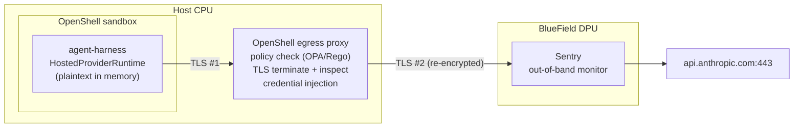

# Security architecture: sandbox policy and egress monitoring

Status: **draft.** The sandbox policy was validated against a live OpenShell
0.1.2 gateway on 2026-09-30 (section 1, *Live validation*). The BlueField /
Sentry design in section 2 is not validated.
Claims about NVIDIA products are limited to what their public docs state; see
[Sources](#sources). Anything not stated there is marked *unverified*.

## 1. Review of `openshell-policy.yaml`

What the harness touches at runtime (as of the `src/harness/` layout):

| Resource | Where in code | Needs |
|---|---|---|
| Compiled binary `agent-harness` | `src/main.rs` | execute, read-only |
| Source tree `src/` | — | **nothing** (compiled in) |
| Learned heuristics | `harness::AdaptiveMemoryLayer` | **process memory only**; nothing is written to disk |
| Hosted inference | `HostedProviderRuntime<ProviderModel>` via rig/reqwest | HTTPS to the provider's API host |
| Local inference | `ProviderModel` with `ollama:` spec | HTTP to Ollama (default port 11434) |
| Credentials | read by rig from `ANTHROPIC_API_KEY`, `OPENAI_API_KEY`, `GEMINI_API_KEY`, `OPENROUTER_API_KEY` | env vars |

### Findings on the original policy

These apply to the first version of `openshell-policy.yaml`, which used a
non-OpenShell schema. **The file has since been replaced with the draft
below**, which addresses every finding.

| # | Severity | Finding |
|---|---|---|
| 1 | **Blocker** | The file does not follow the OpenShell policy schema. OpenShell's top-level keys are `version`, `filesystem_policy`, `landlock`, `process`, `network_policies`, `network_middlewares`. The keys `metadata`, `spec`, `sandbox`, `storage.mounts`, `network.allow_outbound` and `intercept_signals` are not in it, so the file as written would not express the intended boundary. |
| 2 | High | `host: "://openai.com"` / `"://anthropic.com"` are malformed (URL fragments, not hostnames), and are not the hosts rig calls. Use `api.openai.com` and `api.anthropic.com`. |
| 3 | High | `./secure_vault/` is mounted read-write "for adaptive memory", but `AdaptiveMemoryLayer` never touches disk. The mount has no consumer today. Either keep it (for a future persistence layer) or drop it; a writable path nobody needs is attack surface. |
| 4 | Medium | `./src/` is mounted read-only "to prevent self-modification", but the process runs the **compiled binary**, not the source. Protecting `src/` does not protect the executable. The binary's path is what must be read-only (and ideally the only thing on the exec allow-list). |
| 5 | Medium | `localhost:11434` inside a sandbox is the sandbox's own loopback, not the host's Ollama, and OpenShell rejects loopback (`127.0.0.0/8`) in `allowed_ips`. OpenShell's provider docs reach host-side Ollama at `host.openshell.internal:11434`; set `OLLAMA_API_BASE_URL=http://host.openshell.internal:11434` and allowlist that host. |
| 6 | Low | `ProviderModel` also supports Gemini and OpenRouter. With `deny_all_other_outbound`, `/model gemini` or `/model openrouter:…` will fail at request time. Fine if intended; list them if not. *(Gemini has since been added for testing; OpenRouter remains excluded.)* |
| 7 | Low | The "Token and Credential Masking" section declares no masking. Masking is not a policy field: attach an OpenShell provider (`anthropic`, `openai`) to the sandbox and the agent's `ANTHROPIC_API_KEY` / `OPENAI_API_KEY` become opaque placeholders that the proxy resolves in outbound **header values**, which covers rig's `x-api-key` and `Authorization: Bearer`. No code change or `request_body_credential_rewrite` is needed. Placeholders resolve only at the provider's bound endpoints. |
| 8 | Low | Comment "Claude Pro CLI Gateway" is inaccurate: the harness calls the Anthropic API with an API key, not a Claude subscription. |

### Schema facts that shape the policy

Checked against the full OpenShell v0.0.116 policy reference and provider
docs (see [Sources](#sources)); re-check if you run a different version.

| Area | Rule |
|---|---|
| `version` | Integer, must be `1` (not `"1.0"`). |
| Static vs dynamic | `filesystem_policy`, `landlock`, `process` are locked at sandbox creation. `network_policies`, `network_middlewares` hot-reload via `openshell policy update` / `set`. |
| `filesystem_policy` | `include_workdir`, `read_only`, `read_write`. Absolute paths, no `..`, `/` alone rejected as read-write, at most 256 paths. Unlisted paths are inaccessible. Disk-loaded YAML that fails validation falls back to a restrictive default. |
| `landlock.compatibility` | `best_effort` (default: skips missing paths, can run without Landlock) or `hard_requirement` (any gap aborts startup). |
| `process` | `run_as_user`, `run_as_group`: `sandbox` or a numeric id 1–4294967294. Root (`0`) is rejected. |
| Network entry | `name` (optional), `endpoints` and `binaries` (both required). Only listed binaries may reach listed endpoints. |
| `protocol` | `rest`, `websocket`, `graphql`, `mcp`, `json-rpc` (L7 inspected), `tcp` (DNS host, no payload inspection), or omitted (L4 passthrough). **`rest` requires `access` or `rules`.** |
| `access` | `read-only` = GET/HEAD/OPTIONS; `read-write` adds POST/PUT/PATCH; `full` = all methods. Mutually exclusive with `rules`. |
| `rules` | `- allow: {method, path, query?}`; path globs `*`, `**`, `?`. `deny_rules` take precedence over allows. |
| `enforcement` | `enforce` blocks; `audit` logs and allows. |
| `tls` | Auto-detected and terminated for inspection; `skip` only for mTLS or non-standard protocols (rejected on credentialed endpoints unless `allow_uninspected_credentials`). |
| `allowed_ips` | SSRF override. Loopback, link-local and `0.0.0.0` are rejected. Exact hostnames may resolve to RFC 1918 addresses without it. |
| Credentials | Attached providers expose placeholders; the proxy resolves them in header values, Basic/Bearer auth, query parameters and URL paths, and in bodies only with `request_body_credential_rewrite: true`. |
| `network_middlewares` | Up to 10 ordered stages per policy: `middleware` (e.g. `openshell/regex`), `order` (unique), `config`, `on_error` (`fail_closed` default / `fail_open`), `endpoints.include` / `exclude`. Runs after policy admits a request, before credential injection. |

Requests the harness actually makes (from rig 0.43's source; Gemini's automatic `cachedContents` caching is opt-in and not used):

| Provider | Endpoint |
|---|---|
| Anthropic | `POST https://api.anthropic.com/v1/messages`, key in `x-api-key` |
| OpenAI | `POST https://api.openai.com/v1/responses` (the harness builds the model with `.responses(id)`), key in `Authorization: Bearer` |
| Gemini | `POST https://generativelanguage.googleapis.com/v1beta/models/{model}:generateContent`, key in `x-goog-api-key` |
| Ollama | `POST {OLLAMA_API_BASE_URL}/api/chat`, plain HTTP |

### Current policy

This is the content of `openshell-policy.yaml` (minus its header comments).
It was written against the v0.0.116 schema and OpenShell 0.1.2 loads it
unchanged (see *Live validation*). `run-bounded.sh` re-checks the structural
rules above on every launch. Assumes the binary is installed at `/app/agent-harness`.

```yaml
version: 1

filesystem_policy:
  include_workdir: false
  read_only:
    - /app/agent-harness   # the executable, not src/ (finding 4)
    - /usr
    - /lib
    - /etc                 # CA bundle for TLS, resolv.conf
  read_write:
    - /tmp
    # - /app/secure_vault  # only once a persistence layer exists (finding 3)

landlock:
  compatibility: hard_requirement   # never run with a filesystem gap

process:
  run_as_user: sandbox
  run_as_group: sandbox

network_policies:
  anthropic:
    name: anthropic-api
    endpoints:
      - host: api.anthropic.com
        port: 443
        protocol: rest
        enforcement: enforce
        rules:
          - allow: { method: POST, path: /v1/messages }
    binaries:
      - path: /app/agent-harness

  openai:
    name: openai-api
    endpoints:
      - host: api.openai.com
        port: 443
        protocol: rest
        enforcement: enforce
        rules:
          - allow: { method: POST, path: /v1/responses }
    binaries:
      - path: /app/agent-harness

  gemini:
    name: gemini-api
    endpoints:
      - host: generativelanguage.googleapis.com
        port: 443
        protocol: rest
        enforcement: enforce
        rules:
          - allow: { method: POST, path: "/v1beta/models/*:generateContent" }
    binaries:
      - path: /app/agent-harness

  ollama:
    name: ollama-host
    endpoints:
      - host: host.openshell.internal
        port: 11434
        protocol: rest
        enforcement: enforce
        rules:
          - allow: { method: POST, path: /api/chat }
    binaries:
      - path: /app/agent-harness
```

Notes on the draft:

- `rules` allow only the single call each provider needs, which is tighter than `access: read-write`. If a future rig version switches endpoint (e.g. OpenAI Chat Completions at `/v1/chat/completions`), requests will be blocked and appear in the logs; widen the rule then.
- The `read_only` system paths assume a dynamically linked Linux binary. A fully static (musl) build could drop `/usr` and `/lib`. Compare with OpenShell's default policy before trimming further.
- Credentials: attach OpenShell `anthropic` / `openai` providers rather than passing real keys in the environment (finding 7).
- Gemini (Google AI Studio key): OpenShell 0.1.2 has no built-in provider type for it (`google-vertex-ai` is Vertex AI, a different endpoint and auth), so this repo ships a custom profile, `providers/gemini.yaml` (id `agent-harness-gemini`): credential `GEMINI_API_KEY` with `auth_style: header`, `header_name: x-goog-api-key` (how rig sends it), one rule `POST /v1beta/models/*:generateContent`, binary `/app/agent-harness`. With a `gemini` provider of that type attached, the sandbox holds only a placeholder and the proxy substitutes the key (validated live on 2026-10-01 with `gemini-3.5-flash`). No `credential_binding` is needed in the sandbox policy: the profile's endpoint binds it.
- OpenRouter is intentionally absent (finding 6).
- With the docker driver, `host.openshell.internal` maps to `127.0.0.1` in a host-networked supervisor. On colima/lima that is the Linux VM, not the Mac, so Ollama running on the Mac is unreachable from the sandbox without a relay, the same issue as the gateway relay below.
- `network_middlewares` is omitted. A `openshell/regex` redaction stage is possible, but the reference only documents `config: { mode: redact }`; see OpenShell's Supervisor Middleware docs before adding one.

### Live validation (2026-09-30)

Environment: OpenShell 0.1.2 (Homebrew gateway, `docker` compute driver),
colima VM on macOS arm64 (kernel 6.8, Landlock in the active LSM list), image
built from `sandbox.Dockerfile` (Debian trixie). `validate-openshell.sh` runs
all of it; every check passed.

| Check | Result |
|---|---|
| Policy accepted | Loaded unchanged; `openshell policy get` reports it `Effective`, source `sandbox`. Stored as policy version 2. |
| Gateway baseline | The effective policy adds read-only `/proc`, `/var/log`, `/dev/urandom` and read-write `/dev/null` to the file's paths. |
| Process | Runs as `sandbox` (uid 999), `NoNewPrivs: 1`, `Seccomp: 2` (filter). |
| Filesystem | Writes succeed only in `/tmp`; `/app`, `/etc`, `/usr`, `/` are denied. `/var/lib` and `/root` (not allowlisted) are unreadable, so Landlock enforces the allowlist rather than plain DAC. |
| Binary pinning | `curl` to `generativelanguage.googleapis.com` and `api.anthropic.com` (listed hosts) is refused: only `/app/agent-harness` may use those policies. |
| Unlisted host | `curl https://example.com` is refused. |
| Allowed path | `agent-harness` → Gemini `generateContent` with a dummy key gets Google's `API_KEY_INVALID` reply, so the request crossed the proxy. No real credential used. |
| Credential injection | With an `agent-harness-openai` provider attached, the sandbox's `OPENAI_API_KEY` is an `openshell:…` placeholder. A dummy-key provider makes OpenAI reply `Incorrect API key provided: sk-dummy…`, so the proxy substituted the value. `curl` holding the placeholder is refused. |
| Live OpenAI | `agent-harness` → `gpt-5.6` via `POST /v1/responses` with a real key held only by the gateway: answered normally (opt-in check, one request). |
| Task in the sandbox (2026-10-01) | `verified-fix self-test` runs CBMC 6.6.0 and `gcc` on every corpus case under Landlock, seccomp and the `sandbox` user: originals fail, reference fixes verify, the audit chain verifies. The policy covers the task's declared `sandbox-needs` (`/usr/bin/cbmc`, `/bin/sh`, `/usr/bin/gcc`; checked by the script). |
| Gemini key injection (2026-10-01) | Custom profile `providers/gemini.yaml`: the sandbox sees only a placeholder for `GEMINI_API_KEY`, `curl` cannot use it, and `agent-harness` with `gemini-3.5-flash` made a structured tool call and answered correctly, so the proxy substituted the key in `x-goog-api-key`. (`gemini-3.8-flash` and `gemini-2.5-flash` returned Google 503 "high demand" at the time.) |
| Live task (2026-10-01) | `verified-fix run` with `gpt-5.6`, patches auto-approved: `average_div_zero` accepted in 4 turns (5,277 tokens), `pitch_overflow` accepted in 4 turns (6,513 tokens) after one audited retry. All six acceptance checks passed. |

Not yet exercised: the L7 `rules` themselves (a disallowed method or path
from the pinned binary), the Anthropic and Ollama paths, and hot reload with
`openshell policy set`.

#### OpenShell 0.1.2 behaviours found by the live task runs

- **Connections are reset about 10 s into a sandbox's life.** The
  supervisor's settings poll reports `provider_env_changed:true` (with no
  policy change) and closes every proxied connection opened under the old
  policy generation (`DENIED ... L7 tunnel closed before inspection because
  policy changed: policy generation is stale`). The next request on a
  reused connection fails before it is sent. `AgentLoop` therefore retries
  model requests that rig classifies as transient (at most 2 retries, 250 ms
  then 1 s), and records each failed attempt as a `model_retry` audit event.
- **A profile's `binaries` do not limit who gets the credential.** The OpenAI
  key was substituted for `/app/verified-fix`, which the `agent-harness-openai`
  profile does not list, because the sandbox policy lets that binary reach
  `api.openai.com`. Profiles add egress; the sandbox policy's `binaries` are
  the real gate on who can use an injected key, so keep them minimal.

#### Provider profiles widen the policy

Attaching a provider adds the profile's `endpoints` and `binaries` to the
effective policy as a separate `_provider_<name>` entry, concatenated with the
sandbox policy rather than intersected with it. NVIDIA's example
`providers/openai.yaml` (v0.1.2) grants `api.openai.com` `access: read-write`
to `/usr/bin/curl`, so attaching it unchanged would let any curl in the image
call OpenAI with the injected key. This repo's `providers/openai.yaml`
(id `agent-harness-openai`) mirrors `openshell-policy.yaml` instead: binary
`/app/agent-harness`, one rule `POST /v1/responses`. `validate-openshell.sh`
fails if the imported copy drifts from the file. The brew install ships no
profiles; import it with `openshell profile import -f providers/openai.yaml`,
then create the provider from your shell so the key never appears in a
command line:

```sh
read -rs OPENAI_API_KEY && export OPENAI_API_KEY
openshell provider create --name openai --type agent-harness-openai --credential OPENAI_API_KEY
unset OPENAI_API_KEY
```

Local setup notes (colima):

- The Homebrew gateway service does not see docker contexts. Put
  `DOCKER_HOST=unix://$HOME/.colima/default/docker.sock` and
  `OPENSHELL_COMPUTE_DRIVER=docker` in `~/.config/openshell/gateway.env`.
- The docker driver starts the supervisor with host networking and
  `OPENSHELL_ENDPOINT=https://127.0.0.1:17670`, which on colima is the VM. A
  relay from VM `127.0.0.1:17670` to the lima host `192.168.5.2:17670` fixes
  it; `validate-openshell.sh` prints the command when the gateway is
  unreachable.
- Sandbox names are capped at 19 characters.

## 2. Egress data path and where Sentry sits

### Correction to the premise

The original brief asked for a map of how Sentry on a BlueField DPU would
monitor "the unencrypted token stream travelling to port 443 **before** this
policy executes". Two parts of that don't hold for this topology:

1. **There is no unencrypted stream on the wire to port 443.** rig/reqwest
   encrypts inside the harness process. Plaintext (prompt, completion, API
   key) exists only in process memory and inside any TLS-terminating proxy.
2. **Outbound traffic reaches the DPU *after* the policy, not before.** The
   OpenShell policy is evaluated at the sandbox's egress proxy on the host;
   packets only reach the NIC/DPU once the proxy has let them out.

The one plaintext hop in this system is local Ollama over HTTP on port 11434.
It goes from the sandbox to `host.openshell.internal` on the same machine, so
it should not cross the NIC or DPU either (*unverified* for every OpenShell
compute driver's network topology).

### Path



| Hop | Plaintext visible? | Enforcer |
|---|---|---|
| Inside harness process | yes | the code itself (`ModelRuntime` boundary) |
| OpenShell proxy | yes, for inspected HTTPS: the proxy terminates TLS | OpenShell policy |
| NIC / BlueField DPU | not from TLS #2 on its own | Sentry |
| Provider | yes | provider |

### What Sentry contributes

Per NVIDIA's public material, Sentry runs on BlueField and "inspect[s] agent
requests and responses, provide[s] attested telemetry, verif[ies] agent
identity, and enforce[s] … zero-trust access policies", operating "independently
of the host". In Vera Rubin POD systems the BlueField-4 "sits on the node's only
path to the model".

Its value in this architecture is **independence**: if the host or the
OpenShell proxy is compromised, Sentry is a second, out-of-band enforcement
point on the only egress path.

*Unverified:* how Sentry sees request/response content given TLS #2. It could
use its own TLS termination, attested telemetry exported from OpenShell, or
flow metadata only (destination IP/port, SNI, sizes, timing). This decides
whether Sentry can check *content* or only *destinations*; confirm it with
NVIDIA before designing around content inspection.

### Recommendations

- Treat OpenShell's proxy as the content-inspection point and Sentry as the
  independent destination/identity check. Do not assume either sees the other's
  view.
- For audit logging of prompts, the cheapest plaintext tap is in-process: a
  `ModelRuntime` decorator (`AuditedRuntime<R: ModelRuntime>`) that records
  and redacts before calling the inner runtime. It needs no TLS interception
  and keeps static dispatch.
- Prefer OpenShell credential injection (finding 7) so the sandbox never holds
  real keys; then even a plaintext leak from the process exposes placeholders.

## Sources

- [OpenShell policy schema reference](https://docs.nvidia.com/openshell/v0.0.116/reference/policy-schema)
- [OpenShell: manage providers](https://docs.nvidia.com/openshell/v0.0.116/sandboxes/manage-providers) (placeholder resolution locations, `host.openshell.internal`)
- [OpenShell: providers v2](https://docs.nvidia.com/openshell/v0.0.116/sandboxes/providers-v2) (static credential endpoint binding)
- [OpenShell overview](https://docs.nvidia.com/openshell/about/overview)
- [Add runtime controls to AI agents with NVIDIA OpenShell](https://developer.nvidia.com/blog/add-runtime-controls-to-ai-agents-with-nvidia-openshell/)
- [NVIDIA Open Agent Safety Platform: OpenShell on the CPU, Sentry on BlueField-4 (StorageReview)](https://www.storagereview.com/news/nvidia-open-agent-safety-platform-openshell-sentry-bluefield-4)
- [NVIDIA Open Agent Safety Platform](https://www.nvidia.com/en-us/solutions/ai/agent-safety/)
